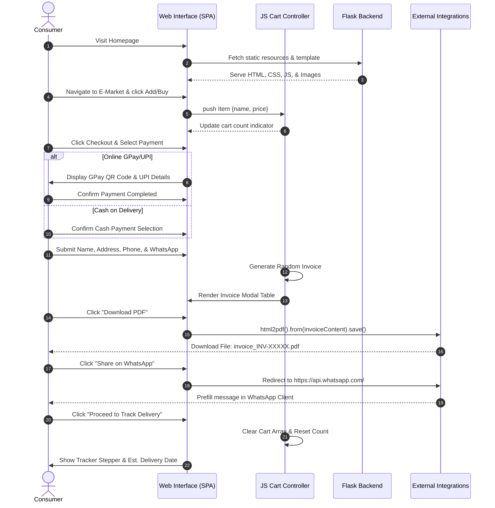
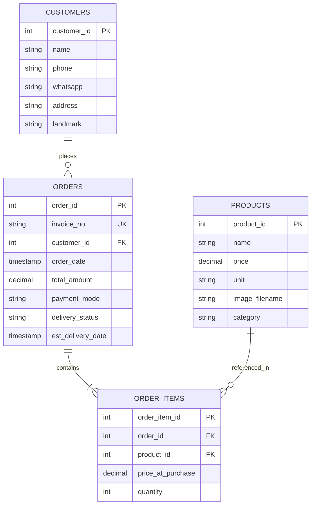

# Agro Medknow Nexus (Agro E-Market) 🌾🛒

[](https://www.python.org/)
[](https://flask.palletsprojects.com/)
[](https://getbootstrap.com/)
[](https://developer.mozilla.org/en-US/docs/Web/JavaScript)
[](https://opensource.org/licenses/MIT)
[](https://github.com/)

> **Connecting Bharat's Farmers to India's Homes** — A premium, farm-to-home agricultural marketplace designed to bypass intermediaries, delivering farm-fresh fruits, vegetables, and greens at wholesale rates with express nationwide logistics.

---

## 📋 Table of Contents
1. [Executive Summary](#-executive-summary)
2. [Key Features](#-key-features)
3. [Technology Stack](#-technology-stack)
4. [System Architecture](#-system-architecture)
5. [Feature Modules](#-feature-modules)
6. [User Workflow](#-user-workflow)
7. [Folder Structure](#-folder-structure)
8. [Installation Guide](#-installation-guide)
9. [Environment Variables](#-environment-variables)
10. [Database Schema & State Design](#-database-schema--state-design)
11. [API Documentation](#-api-documentation)
12. [Authentication & Authorization](#-authentication--authorization)
13. [Security Implementation](#-security-implementation)
14. [Performance Optimizations](#-performance-optimizations)
15. [Deployment Guide](#-deployment-guide)
16. [CI/CD Pipeline Blueprint](#-cicd-pipeline-blueprint)
17. [Testing Suite Setup](#-testing-suite-setup)
18. [Screenshots](#-screenshots)
19. [Product Roadmap](#-product-roadmap)
20. [Scalability Considerations](#-scalability-considerations)
21. [Real-World Use Cases](#-real-world-use-cases)
22. [Contributing Guidelines](#-contributing-guidelines)
23. [License](#-license)
24. [Author & Support](#-author--support)
25. [Acknowledgements](#-acknowledgements)
26. [Project Statistics](#-project-statistics)
27. [SEO Keywords](#-seo-keywords)

---

## 🌟 Executive Summary

### What the Project Does
**Agro Medknow Nexus** (commercially known as **Agro E-Market**) is a high-fidelity web application implementing a direct-to-consumer (D2C) marketplace for agricultural produce. The platform lists over 40 varieties of fruits, vegetables, greens, and herbs, allowing consumers to compile custom carts, execute checkout, render digital invoices, download them as high-quality PDFs locally, share order summaries instantly to WhatsApp, and monitor their order's shipment via an interactive stepper tracking portal.

### Why It Exists (Problem Statement)
Indian agriculture suffers from highly fragmented supply chains. Traditional distribution pathways consist of multiple middlemen (commission agents, wholesalers, sub-wholesalers, retailers), which results in:
1. **Grower Exploitation**: Farmers receive only a minor fraction (often 25-35%) of the final retail price.
2. **Quality Degradation**: Transit delays and suboptimal handling compromise the freshness of greens and fruits.
3. **Consumer Overpricing**: Consumers pay inflated rates for stale products.

### Business Value
By eliminating intermediaries, **Agro Medknow Nexus** establishes a direct linkage between rural farming clusters and urban centers.
* **Farmer Empowerment**: Higher margin capture directly at the source.
* **Cost Efficiency**: Retail pricing savings of up to **30%** for end consumers compared to local hypermarkets.
* **Economic Loop**: Encourages rural micro-entrepreneurship and localized logistics networks.

### Technical Value
The codebase serves as a fast-loading, highly interactive Single Page Application (SPA) containerized behind a Python-Flask backend. It demonstrates:
* Clean, modular JS state management (cart and catalog processing).
* HSL-tailored custom styling system with high-end glassmorphism elements, CSS gradients, dynamic pulse states, and zero layout shift.
* Decoupled integration with external utility pipelines (`html2pdf.js` for client-side rasterization and WhatsApp Messaging APIs).

---

## ✨ Key Features

### 🛒 High-Fidelity Marketplace Catalog
* **Dynamic Grid Render**: Renders 40+ products from structured arrays, displaying precise pricing metrics based on unit types (per kg, piece, bunch, packet, 100g).
* **Dual Checkout Hooks**: Incorporates a cumulative shopping cart flow ("Add to Cart") and a rapid purchase pipeline ("Buy Now") that isolates a single item to expedite completion.

### 💳 Complete Checkout Wizard Flow
1. **Interactive Cart Modal**: Computes line item prices, aggregates totals in real-time, and routes to payment screens.
2. **Flexible Payments Gateway**:
   * *Online Payment (GPay/UPI)*: Displays a dynamic visual QR code (`static/gpay_qr.png`) paired with the registered merchant UPI ID (`achaiyanachaiyan-2@okhdfcbank`).
   * *Cash on Delivery (COD)*: Provides immediate checkout validation without upfront transaction barriers.
3. **Delivery Logistics Collector**: Captures validated shipping details, active phone contacts, and specific landmarks.
4. **Dynamic Invoice Compiler**: Synthesizes custom transaction invoices on the fly containing random invoice numbers (`#INV-XXXXX`), localized date formatting, and itemized billing tables.

### 📄 Enterprise Sharing & Export Protocols
* **Client-Side PDF Generator**: Integrates the `html2pdf.js` canvas serialization engine to cleanly format, adjust margins, and export standard Letter-sized PDF invoices directly from the browser.
* **Instant WhatsApp Gateway**: Compiles a structured, markdown-encoded text message summary of the transaction invoice and forwards it directly to the customer's WhatsApp workspace using direct deep-linking.

### 🚚 Flipkart-Style Delivery Tracker
* **Interactive Timeline Stepper**: Translates shipping state arrays into a visual tracking vertical timeline (`Order Confirmed` ➔ `Packed` ➔ `In Transit` ➔ `Delivered`).
* **Visual Pulsing Indicators**: Displays active shipping milestones with pulsing green highlights.
* **Estimated Logistics Calculation**: Dynamically generates expected delivery dates (+3 days from checkout) customized to the client's address and landmark input.

---

## 🛠️ Technology Stack

| Layer | Technology | Purpose |
| :--- | :--- | :--- |
| **Backend Framework** | Python 3.8+ / Flask 2.0+ | Server-side routing, static asset management, template rendering. |
| **Production Server** | Gunicorn | WSGI HTTP Server for production scaling. |
| **Frontend Layout** | HTML5 / Bootstrap 5.3.0 | Semantic document structure and responsive grid systems. |
| **Styling & Theme** | CSS3 (HSL Variables) | Premium Dark/Forest Green aesthetic with glassmorphism overlays and custom transition curves. |
| **Iconography** | Font Awesome 6.4.0 | Vector icons for UI elements and navigation indicators. |
| **Client Scripting** | Vanilla ES6+ JS | Dynamic grid creation, interactive cart state, modal routing, and event delegation. |
| **PDF Generation** | html2pdf.js (v0.10.1) | Client-side DOM parsing and PDF canvas rasterization. |
| **Integrations** | WhatsApp API | Direct deep-link communications for invoice sharing. |

---

## 📐 System Architecture

### Architectural Explanation
The application utilizes a **Client-Server Architecture** designed as a lightweight SPA (Single Page Application). 
1. **Flask (Server Core)**: Acts as the static web server serving the shell (`index.html`) and associated styling, script, and image payloads.
2. **Client Layer (Browser)**: Runs the application runtime inside the user's viewport.
3. **State Controller (`script.js`)**: Manages the local catalog, handles reactive modifications to the cart array, and manipulates modal navigation via Bootstrap JS wrappers.
4. **Integrations Tier**: Communicates out-of-band with client-side engines (`html2pdf.js` utilizing HTML Canvas context) and WhatsApp's API to distribute order metrics.

```mermaid
graph TD
    subgraph Client Tier (Browser Sandbox)
        UI[index.html Layout] <--> Style[style.css Rules]
        UI <--> State[script.js Controller]
        State -->|Manage Cart & UI| UI
        State -->|Export DOM to canvas| PDF[html2pdf.js Engine]
        State -->|Generate Text payload| WA[WhatsApp API Gateway]
        PDF -->|File Download| LocalDrive[(User Local Storage)]
    end

    subgraph Backend Web Tier
        App[app.py Flask Application]
        Static[Static Directory CSS, JS, Images]
        Templates[Templates index.html]
    end

    UI <-- HTTP Request/Response --> App
    App --> Templates
    App --> Static
```

---

## 📦 Feature Modules

### 1. Landing Portal & Value Proposition
Located inside the landing page container, this module outlines key direct-to-consumer advantages (Quality, Cost, Velocity) and renders a stylized accordion FAQ component that resolves customer queries regarding product sourcing, lower prices, and logistics availability.

### 2. Product Showcase Grid
Uses standard JS loops to inject the mock product database containing 40+ customized items. It dynamically maps unit structures and prices to build responsive grid elements. Features individual "Add to Cart" and "Buy Now" CTA bindings.

### 3. Shopping Cart & Checkout Wizard
Maintains an in-memory `cart` array. Performs additions, counts occurrences of identical items, renders summary tables, and controls step transitions across the Checkout Modal, Payment Mode selector (GPay/UPI vs. COD), and Delivery Address Form.

### 4. Billing & Invoice Dispatcher
Constructs a transaction template. Extracts values from user input and cart aggregates. Uses `html2pdf.js` configuration parameters to execute an exact client-side PDF export. Converts the order receipt into a WhatsApp deep-link (`https://api.whatsapp.com/send?phone=...`).

### 5. Fulfillment & Tracker Stepper
Initializes when the user confirms their invoice. Automatically calculates estimated receipt times (+3 days, e.g., mapping `June 20` to `June 23`), displays active transport statuses via custom-themed stepper icons, and prompts clear-cart garbage collection upon completion.

---

## 🔄 User Workflow



---

## 📁 Folder Structure

```
Agro_Medknow_Nexux-main/
│
├── app.py                      # Flask backend entrypoint & route server
├── requirements.txt            # Python dependencies configuration
├── README.md                   # Enterprise system documentation
│
├── templates/
│   └── index.html              # Core single-page HTML template & modals
│
└── static/
    ├── gpay_qr.png             # Google Pay/UPI static scanning code
    ├── apple.jpg               # Catalog image asset
    ├── banana.jpg              # Catalog image asset
    ├── beetroot.jpg            # Catalog image asset
    ├── ...                     # Other product image assets (40+ items)
    │
    ├── css/
    │   └── style.css           # Premium stylesheet with HSL system
    │
    └── js/
        └── script.js           # Client application controller & state
```

---

## 🚀 Installation Guide

### Prerequisites
* **Python**: `3.8` or higher installed on your environment. Check version:
  ```bash
  python --version
  ```

### Step 1: Clone the Repository
Clone the directory locally and change directory to the repository folder:
```bash
git clone https://github.com/your-username/agro-e-market.git
cd agro-e-market/Agro_Medknow_Nexux-main
```

### Step 2: Establish a Virtual Environment
Isolate python modules within a dedicated virtual environment:
* **Windows (PowerShell)**:
  ```powershell
  python -m venv venv
  .\venv\Scripts\Activate.ps1
  ```
* **macOS/Linux**:
  ```bash
  python3 -m venv venv
  source venv/bin/activate
  ```

### Step 3: Install Package Dependencies
Install the required system libraries using pip:
```bash
python -m pip install --upgrade pip
python -m pip install -r requirements.txt
```

### Step 4: Execute the Application
Run the local development server:
```bash
python app.py
```
Output indicators will prompt that the application is running:
```
 * Serving Flask app 'app'
 * Debug mode: on
 * Running on http://127.0.0.1:5000
```
Open **[http://127.0.0.1:5000/](http://127.0.0.1:5000/)** in your browser.

---

## 🔐 Environment Variables

Standard configurations for deploying Flask applications in enterprise environments:

| Variable Name | Default Value | Description | Required in Production |
| :--- | :--- | :--- | :--- |
| `FLASK_APP` | `app.py` | Sets the application entrypoint for the flask run CLI. | Yes |
| `FLASK_ENV` | `development` | Switches between `development` and `production` modes. | Yes (set to `production`) |
| `PORT` | `5000` | Port on which the HTTP server binds (e.g., set to `8000` or `10000`). | Yes |
| `SECRET_KEY` | `dev-secret-key` | Used for session cookies and cryptographic signing of requests. | Yes |

---

## 🗄️ Database Schema & State Design

### Client-Side State Model
The application maintains its active data structure using a mock document schema in `script.js`. If migrated to a relational database (e.g., PostgreSQL), the schema is modeled as follows:



### Mock State Data Structure (JavaScript)
The client-side product mapping is represented inside `static/js/script.js` as an array of objects:
```javascript
{
  name: 'Fresh Apples',
  price: 120,
  unit: 'kg',
  image: 'apple.jpg'
}
```

---

## 🔌 API Documentation

### Backend Routes

#### `GET /`
* **Description**: Returns the core single page application container containing CSS bindings, HTML templates, and JS logic.
* **Response**: `200 OK` (MIME: `text/html`).

---

### Client-Side Virtual Routes (Navigation State)

#### `showSection(sectionId)`
* **Description**: Manages viewports inside the single-page application.
* **Arguments**:
  * `sectionId` (string): Identifies target viewport. Supported values: `'home'`, `'agro-market'`.
* **Behavior**: Scrolls context window to `(0, 0)`, updates active states on header navigations, toggles `.d-none` CSS utilities.

---

### Export & Sharing Interface Endpoints

#### PDF Export API (`html2pdf.js`)
* **Target Elements**: `#invoiceContent` DOM elements.
* **Output Payload**: File download named `invoice_#INV-[10000-99999].pdf`.

#### WhatsApp API Dispatcher
* **Destination Endpoint**: `https://api.whatsapp.com/send`
* **Query Parameters**:
  * `phone`: Client Phone ID prefixed with country code (e.g., `919876543210`).
  * `text`: Encoded ASCII/Markdown string representing billing summary details.

---

## 🔑 Authentication & Authorization

### Current Implementation
The application employs an **inclusive guest-checkout model**:
* **No Authentication Barrier**: Maximizes conversion by allowing immediate shopping cart compilation.
* **Session Lifetime**: Cart data persists in the memory heap of the window tab. Closing or reloading resets the checkout workspace.

### Enterprise Upgrade Recommendation
To support secure B2B bulk orders or retail subscription flows:
1. **OAuth2 / OpenID Connect**: Introduce Google/Apple sign-in.
2. **Flask-Login / JWT**: Secure backend API endpoints and user sessions with signed JSON Web Tokens.
3. **RBAC (Role-Based Access Control)**:
   * `Customer`: Place orders, track personal items.
   * `Farmer/Seller`: Update catalogs, change vegetable/fruit rates.
   * `Admin/Logistics`: Update transit steps on trackers.

---

## 🛡️ Security Implementation

### Existing Security Measures
* **URI Sanitization**: Uses `encodeURIComponent()` during string concatenation to prevent injection vectors inside WhatsApp API links.
* **Local Sandbox Rendering**: PDF compilation happens strictly on the user's processor via the canvas rendering context, avoiding transmission of raw customer address details over the open internet.

### Production Security Hardening Recommendations
To migrate this codebase to public production servers:
1. **HTTPS Enforcement**: Install SSL certificates and redirect all HTTP traffic.
2. **Disable Flask Debug Mode**: Ensure `debug=False` is set inside `app.py` when initiating deployments to prevent remote execution vulnerability exploits.
3. **Content Security Policy (CSP)**: Establish strict CSP headers to control resource loads from CDNs (Bootstrap, Font Awesome).
4. **Input Sanitization**: Apply regex verification on inputs (e.g., phone numbers and names) on both frontend forms and backend API endpoints.

---

## ⚡ Performance Optimizations

* **Asynchronous Asset Loading**: External scripts (`Bootstrap`, `html2pdf.js`) load at the footer of `index.html` to minimize Render-Blocking Resources.
* **Hardware-Accelerated CSS Transitions**: Transitions are bound to properties like `transform` and `opacity` to invoke GPU rasterization:
  ```css
  transition: all 0.3s cubic-bezier(0.16, 1, 0.3, 1);
  ```
* **Performance CSS Gradients**: Utilizes multi-stop linear/radial background gradients instead of heavy high-res agricultural background images, reducing network payloads by several megabytes.
* **Blazing Fast SPA Switches**: Hiding inactive views via simple `.d-none` classes eliminates runtime DOM rebuilding, creating instant sub-millisecond tab switching.

---

## 📦 Deployment Guide

### Option 1: Render / Heroku / Railway (PaaS)
Because the app uses a standard Flask structure with a `requirements.txt` file, PaaS platforms can build it automatically.

1. Create a `Procfile` in the root directory:
   ```
   web: gunicorn app:app
   ```
2. Connect your GitHub repository to the platform.
3. Set the buildpack to **Python**.
4. Define the start command as `gunicorn app:app`.

### Option 2: Docker Containerization
For Kubernetes clusters or AWS ECS deployments:

1. Create a `Dockerfile` inside the root folder:
   ```dockerfile
   FROM python:3.9-slim
   WORKDIR /app
   COPY requirements.txt .
   RUN pip install --no-cache-dir -r requirements.txt
   COPY . .
   EXPOSE 5000
   CMD ["gunicorn", "-b", "0.0.0.0:5000", "app:app"]
   ```
2. Build and run:
   ```bash
   docker build -t agro-e-market .
   docker run -p 5000:5000 agro-e-market
   ```

---

## 🔄 CI/CD Pipeline Blueprint

Create a GitHub Actions workflow in `.github/workflows/deploy.yml` for automated testing and deployment:

```yaml
name: CI/CD Pipeline

on:
  push:
    branches: [ main ]
  pull_request:
    branches: [ main ]

jobs:
  build-and-test:
    runs-on: ubuntu-latest
    steps:
    - name: Checkout Code
      uses: actions/checkout@v3

    - name: Set up Python
      uses: actions/setup-python@v4
      with:
        python-version: '3.10'

    - name: Install Dependencies
      run: |
        python -m pip install --upgrade pip
        pip install -r requirements.txt
        pip install pytest flake8

    - name: Lint Code with Flake8
      run: |
        # stop the build if there are Python syntax errors or undefined names
        flake8 . --count --select=E9,F63,F7,F82 --show-source --statistics

    - name: Validate Flask App Setup
      run: |
        python -c "import app; print('App imported successfully!')"
```

---

## 🧪 Testing Suite Setup

To implement automated tests, configure a Python-based test workspace:

### 1. Install Testing Frameworks
```bash
pip install pytest pytest-flask
```

### 2. Create `tests/test_app.py`
```python
import pytest
from app import app as flask_app

@pytest.fixture
def app():
    yield flask_app

@pytest.fixture
def client(app):
    return app.test_client()

def test_homepage(client):
    """Verify that homepage renders correctly with 200 OK status."""
    response = client.get('/')
    assert response.status_code == 200
    assert b'Agro E-Market' in response.data
```

### 3. Run Tests
```bash
python -m pytest tests/
```

---

## 📸 Screenshots

> [!NOTE]
> Below are mockup visual structures of the Agro Medknow Nexus UI layouts.

| Section | Interface Representation |
| :--- | :--- |
| **Landing Banner** |  |
| **Store Grid** | Renders cards for 40+ fresh produce items with individual action hooks. |
| **Invoice Builder** | Renders a printable clean invoice displaying item counts, pricing, QR payment code, and PDF download buttons. |
| **Order Tracker** | Stepper display showcasing active milestones from confirmation to transit status. |

---

## 🗺️ Product Roadmap

- [ ] **Dynamic Live Database Integration**: Migrate client-side static catalog array to SQLite/PostgreSQL with CRUD admin panels.
- [ ] **Payment Gateway API**: Integrate Razorpay, Stripe, or PhonePe SDKs to verify UPI transaction callbacks in real-time.
- [ ] **SMS Integration**: Configure Twilio/Twillio SMS notifications alongside WhatsApp dispatchers.
- [ ] **Farmer Portal Dashboard**: Build a simplified interface for rural producers to post daily inventory listings and define pricing ranges.
- [ ] **AI-Powered Demand Predictor**: Analyze purchase histories to forecast demand trends, optimizing farm harvesting plans.

---

## 📈 Scalability Considerations

### 1. Database Read-Heavy Scaling
Since catalog requests represent 90% of user traffic, configure a Redis layer caching the product catalog to reduce database queries.

### 2. Image Asset Distribution
Store the 40+ item graphics on an external Content Delivery Network (CDN) (like AWS S3 with CloudFront) rather than hosting them locally from the Flask server. This ensures faster load times for consumers.

### 3. Serverless Auto-scaling
Deploy the Flask container within an auto-scaling environment (like AWS ECS Fargate or GCP Cloud Run) that adjusts running instances based on CPU utilization and requests per second.

---

## 💼 Real-World Use Cases

* **Agricultural Co-operatives (FPOs)**: Farmer Producer Organizations can deploy the portal to directly distribute seasonal harvests to close-by urban centers.
* **Organic Grocery Hubs**: Local distributors can curate organic lines, offering direct traceability links from farms to families.
* **B2B Restaurant Supply**: Tailor checkout flows to restaurant owners looking to purchase bulk produce at wholesale rates.

---

## 🤝 Contributing Guidelines

We welcome contributions from open-source developers to help improve Agro Medknow Nexus.

### Contribution Process
1. **Fork** the repository to your personal profile.
2. **Create a Feature Branch**:
   ```bash
   git checkout -b feature/awesome-new-capability
   ```
3. **Commit Your Changes**: Adhere to semantic commit guidelines:
   ```bash
   git commit -m "feat: integrate Razorpay callback verification"
   ```
4. **Push to Your Branch**:
   ```bash
   git push origin feature/awesome-new-capability
   ```
5. Open a **Pull Request** detailing your modifications and linking open issues.

---

## 📄 License

Distributed under the MIT License. See [LICENSE](LICENSE) for more details.

---

## 🛡️ Author & Support

* **Maintainer**: Agro Medknow Nexus Core Development Team
* **Merchant UPI Gateway Support**: `achaiyanachaiyan-2@okhdfcbank`
* **Issues Portal**: Submit feature requests or bug submissions on our GitHub Issues tracking page.

---

## 🎁 Acknowledgements

* **Indian Farmers**: For their round-the-clock labor feeding the nation.
* **Unsplash**: For providing premium free-to-use photography assets.
* **html2pdf.js Team**: For enabling seamless client-side PDF downloads.

---

## 📊 Project Statistics

| Component / Metric | Quantity |
| :--- | :--- |
| **Major Modules** | 5 Modules |
| **Catalog Products** | 42 Items |
| **Backend Endpoints** | 1 Route (`/`) |
| **External API Integrations** | 2 APIs (html2pdf, WhatsApp) |
| **Interface Steps (Wizard)** | 4 Steps (Cart ➔ Gateway ➔ Address ➔ Invoice) |
| **Tracker Milestones** | 4 Milestones |

---

## 🏷️ SEO Keywords

`agro e-market` `direct-from-farm` `agriculture marketplace` `fresh produce delivery india` `wholesale vegetables online` `farmers direct portal` `flask agricultural portal` `agro medknow nexus` `rural direct supply chain` `online grocery app python`

---

<p align="center">
  <b>Agro Medknow Nexus</b> • Sourced locally, consumed fresh. © 2025.
</p>
